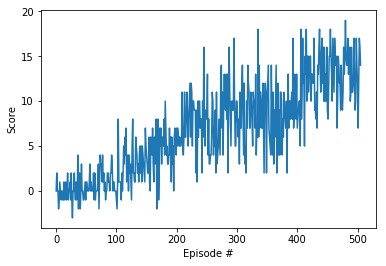

# Algorithm overview
The algorithm used is The original paper can be found [here](https://www.cs.toronto.edu/~vmnih/docs/dqn.pdf). [This](https://medium.com/@jonathan_hui/rl-dqn-deep-q-network-e207751f7ae4) article is good places to start to understand DQN.

In brief, the main features of the algorithm are:

1. It is a [Q-learning](https://en.wikipedia.org/wiki/Q-learning) method, i.e. the algorithm tries to estimate the value Q(s,a) of (state,action) pairs given the current policy.
2. The main feature of DQN is that it gives us a computationally feasible and practically effective way of using the Q-learning algorithm to solve environments with continuous action spaces.
3. (2.) is achieved by replacing a Q-table with a NN that estimates the Q-value for (station, action pairs) that is updated by minimizing a loss function guaranteed to converge towards the optimal policy.
4. Performance of the DQN algorithm is significantly improved by introducing an Experience Buffer, where (state, action, reward, next state) tuples are stored and sampled randomly to train the NN. This avoids the NN learning a poor policy due to correlations between successive (s,a) pairs.
5. Exploration of the (s,a) space is implemented via an ε-greedy policy. 

## Parameters
### Hyperparameters
| Parameter | Value|
| --- | --- |
| Replay buffer size | 1e5 |
| BATCH_SIZE | 64 |        
| GAMMA | 0.99 |           
| TAU | 1e-3 |             
| LR | 5e-4 |        
| UPDATE_EVERY | 4 |       

### Actor network architecture:
| Layer | Size |
| --- | --- |
| input | 37 |
| hidden_1 | 64 |
| ReLU | - |
| hidden_2 | 64 |
| ReLU | - |
| output | 1 |

### Critic network architecture:
| Layer | Size |
| --- | --- |
| input | 33 |
| hidden_1 | 380 |
| ReLU | - |
| concat with actor output | - |
| hidden_2 | 280 |
| ReLU | - |
| output | 1 |

## Solution
We solved the environment in 406 episodes.

   

## Improvements ideas

Implementing Dueling DQN, Prioritized Experience Replay, playing around with the hyperparameters.
